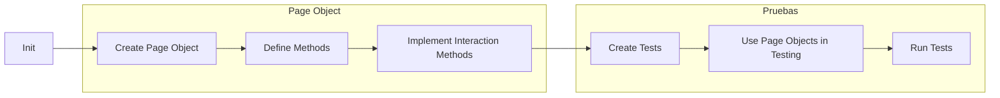

# My demo with playwright!

In this repository will go to implement various features with this framework.

# Features of playwright

 - **Locators:**
 - **Navigations** 
 - **Assertion**
 - **Fill**
 - **setViewportSize**
 - **Intercept**
 - **Pause**
 - **Screenshots**
 - **File Env**

## The project implements pattern POM

